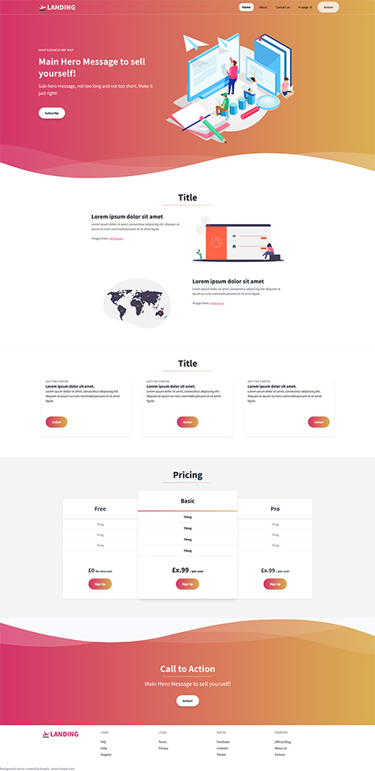

# Nunjucks TailwindCSS Starter Kit

# What it does:

This is a starter-kit that lets you quickly build websites with Nunjucks and gulp, using TailwindCSS.
Nunjucks uses templates for HTML files (change things in 1 place, and all files that use it template/partial will get updated). TailwindCSS is a CSS framework that will only generate CSS code for the classes you've actually used. This keeps the filesize nice and small. Gulp automates everything.

## Requirements

- Node: [https://nodejs.org/en/download](https://nodejs.org/en/download)
- Yarn : [https://yarnpkg.com/](https://yarnpkg.com/) or NPM: [https://www.npmjs.com/](https://www.npmjs.com/)

## Credits

- This is a fork from [https://github.com/wzulfikar/nunjucks-starter-kit](https://github.com/wzulfikar/nunjucks-starter-kit)
- Tailwind Free Landing page template from [https://github.com/tailwindtoolbox/Landing-Page/](https://github.com/tailwindtoolbox/Landing-Page/)

## Reference

- TailwindCSS https://tailwindcss.com/
- Nunjucks official docs: [https://mozilla.github.io/nunjucks]([https://mozilla.github.io/nunjucks)

### How to use

1. download & unzip: [https://github.com/benninkcorien/nunjucks-gulp-tailwindcss/archive/master.zip](https://github.com/benninkcorien/nunjucks-gulp-tailwindcss/archive/master.zip)
   or
   git clone https://github.com/benninkcorien/nunjucks-gulp-tailwindcss.git

- install dependencies: run `yarn install` or `npm install` to install everything listed in package.json
- run `gulp auto` . this will launch browsersync and watch for changes etc.
- try changing one of the pages inside `src/pages` & your browser will auto-reload, displaying the change you just made.

## Screenshot of the resulting homepage

### How to change

Change the .njk files in src/templates/partials or add your own.
Add them to the  block where you want them

    
        
        
        
        
    

## Page variables

### Set page title

You can set the title (browser tab title) in your src/pages \*.njk files

    

### Set page name

Page names are used by the nav menu to mark the current menu item

Add the pages you want to appear in the nav menu to the navitems in src/templates/partials/nav.njk

    

---

# Why?

- works out of the box!
- example included (using tailwind css):
  - `src/pages` for page content
  - `src/templates` for page layout
- output is plain html (stored in `dist` directory)
- serverless
- can use free service like surge.sh, github pages for hosting
- minimum knowledge needed: html, css, js – no need for php, ruby, etc.
- minifier included! use `gulp minify`

## Directory Layout

Here is the project structure:

- `dist` : this directory contains real files that will be hosted
- `dist/assets` : all css, js, images, fonts and whatever assets related to app are located here
- `src` : raw files used to develop the app
- `src/pages` : pages for the app, everything here will be rendered to `dist` directory
- `src/templates` : layout files
- `src/templates/partials` : partial files like nav, user-tabs, menu, etc

## Workflow

Auto-render & live-reload (via browsersync)

run `gulp auto`

- This will open `http://localhost:3000` in your browser
- when you edit any files in `src` the `dist` files will be updated and your browser (`http://localhost:3000`) will be reloaded automatically.

## optional extra commands

(open command line to the folder where gulpfile.js is (root))

**Generate minified css files**
(in dist/assets/css/filename.min.css)

    gulp minifycss

**Minify HTML**

    gulp minifyhtml

#### Images

**Minify images**
! DO NOT UPDATE gulp-imagemin or imagemin-webp to a later versions, they changed something that completely breaks everything.

    gulp minifyimages

**Generate images in custom sizes**
(so you can load smaller images on smaller screens)

Requirements for resizing:

- ImageMagick (https://imagemagick.org/script/download.php)
- GraphicsMagick (on windows search for a GraphicsMagick-1.3-Q8-win64-dll.exe download, I used the one on Sourceforge. GraphicsMagick no longer offers these over FTP)

Specify the sizes you want to generate in the gulpfiles.js, default is [325, 500, 768, 1024]

Run

    gulp resizeimages

This will generate images (same extension as sourcefile) in all the sizes. (filename-1024.png etc)

**Convert PNG/JPG to WebP files**

Put all png or jpg source images in dist/images/convert and run

    gulp convertimages

this will generate \*.webp files and put them in dist/images/webp

---

## Changelog

- 24-2-2022 : Fixed the src path for the css in the header, everything is working now.
- 24-2-2022 : you can now run `gulp minifycss` to minify the css files and generate .min.css files in dist/assets/css
- 24-2-2022 : Added functionality for: images resize (4 custom sizes, width of 325, 500, 768, 1024px is generated for each source file). Minify images (output in dist/images/smaller). Convert images to WebP format (output in dist/images/webp)

## ToDO

Add working contact form?

##### Creative commons

(I don't check github often enough to deal with pull requests. Just download/clone/fork it and then upload it as your own.

Consider whatever I didn't borrow from anyone else - see credits - CreativeCommons CC (no BY needed) )
